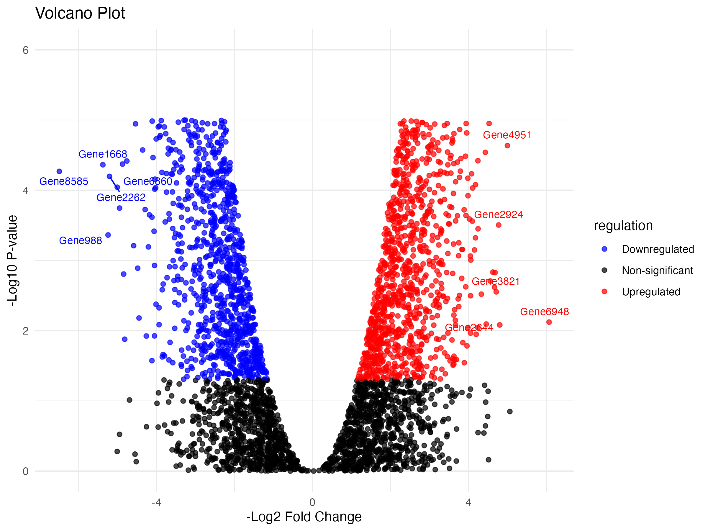

Generate a volcano plot using `Python!

## Introduction

This document demonstrates how to generate a volcano plot using
Python by reading a CSV file that contains gene expression data. The
dataset must include at least three mandatory columns:

-   `log2FC` (Log2 Fold Change)
-   `p_value` (P-value for statistical significance)
-   `Gene_symbol` (or Gene EntrezID or Gene ENSEMBL ID)

Each step is explained in detail, with code chunks for clarity.

## Installing Required Libraries
```python
import subprocess
import sys

required_packages = ['pandas', 'matplotlib', 'seaborn']

# Check for missing packages
for pkg in required_packages:
    try:
        globals()[pkg] = __import__(pkg)
        print(f"{pkg} version: {globals()[pkg].__version__}")
    except ImportError:
        print(f"Error: {pkg} is not installed.")
        print(f"Installing {pkg}...")
        subprocess.check_call([sys.executable, "-m", "pip", "install", pkg])
        globals()[pkg] = __import__(pkg)  # Import the package after installation
        print(f"{pkg} has been installed.")
        print(f"{pkg} version: {globals()[pkg].__version__}")

```

## Import libraries:

```python
import os
import pandas as pd
import seaborn as sns
import matplotlib.pyplot as plt
```

## Setting Up Project Directories
```python
project_dir = "/Users/debojyoti/Projects/seaborn_basics"
data_dir = os.path.join(project_dir, "input_data")
result_dir = os.path.join(project_dir, "results")

os.makedirs(result_dir, exist_ok=True)
```

## Reading the input data using pandas
```python
input_file = os.path.join(data_dir, "test_input_file.csv")
data = pd.read_csv(input_file)
print(data.head())

#	Gene_symbol log2FC  	neg_log10pval	log2FC_sq	p_value
# 0	Gene7	2.267283	1.725017	5.140572	0.018836
# 1	Gene9	3.027636	3.804565	9.166577	0.000157
# 2	Gene11	1.957304	0.261662	3.831041	0.547442
# 3	Gene12	3.429968	3.787973	11.764681	0.000163
# 4	Gene13	-2.083291	3.899395	4.340102	0.000126
```


## Transforming Data for Visualization
```python
pval_cutoff = 0.05
log2fc_cutoff = 1

data["logP"] = -np.log10(data["p_value"])
data["negLog2FC"] = -data["log2FC"]

conditions = [
    (data["p_value"] < pval_cutoff) & (data["negLog2FC"] > log2fc_cutoff),
    (data["p_value"] < pval_cutoff) & (data["negLog2FC"] < -log2fc_cutoff),
]
choices = ["Upregulated", "Downregulated"]
data["regulation"] = np.select(conditions, choices, default="Non-significant")

data.head()

#	Gene_symbol log2FC  	neg_log10pval	log2FC_sq	p_value 	logP    	negLog2FC	regulation
# 0	Gene7	   2.267283	1.725017	5.140572	0.018836	1.725017	-2.267283	Downregulated
# 1	Gene9	   3.027636	3.804565	9.166577	0.000157	3.804565	-3.027636	Downregulated
# 2	Gene11	   1.957304	0.261662	3.831041	0.547442	0.261662	-1.957304	Non-significant
# 3	Gene12	   3.429968	3.787973	11.764681	0.000163	3.787973	-3.429968	Downregulated
# 4	Gene13	   -2.083291	3.899395	4.340102	0.000126	3.899395	2.083291	Upregulated
```

## Selecting Top Genes for Labeling
```python
top_n = 5
top_up = data[data["regulation"] == "Upregulated"].nsmallest(top_n, "log2FC")
top_down = data[data["regulation"] == "Downregulated"].nlargest(top_n, "log2FC")
top_genes = pd.concat([top_up, top_down])

# Set the display width to a larger value, e.g., 1000 characters
pd.set_option('display.width', 120)

top_genes.head()
#	Gene_symbol log2FC neg_log10pval   log2FC_sq  p_value     logP   negLog2FC	regulation
# 2440  Gene6948   -6.064915   2.122147  36.783188  0.007548  2.122147   6.064915      Upregulated
# 1724  Gene4951   -4.996103   4.636459  24.961045  0.000023  4.636459   4.996103      Upregulated
#  900  Gene2644   -4.799338   2.081537  23.033642  0.008288  2.081537   4.799338      Upregulated
# 1002  Gene2924   -4.771924   3.505065  22.771257  0.000313  3.505065   4.771924      Upregulated
# 1326  Gene3821   -4.708490   2.552914  22.169875  0.002800  2.552914   4.708490      Upregulated
```

## Creating the Volcano Plot
```python
plt.figure(figsize=(8, 6))
sns.scatterplot(
    data=data, x="negLog2FC", y="logP", hue="regulation",
    palette={"Upregulated": "red", "Downregulated": "blue", "Non-significant": "black"},
    alpha=0.7
)

for _, row in top_genes.iterrows():
    plt.text(row["negLog2FC"], row["logP"], row["Gene_symbol"], fontsize=8, ha='right')

plt.title("Volcano Plot")
plt.xlabel("-Log2 Fold Change")
plt.ylabel("-Log10 P-value")
plt.ylim(0, 6)
plt.legend(title="regulation")
plt.tight_layout()
plt.show()
```


Inside the plot (default locations): 
'best': Automatically chooses the best location (default), 
'upper left': Legend in the upper-left corner, 
'upper right': Legend in the upper-right corner, 
'lower left': Legend in the lower-left corner, 
'lower right': Legend in the lower-right corner, 
'center left': Legend in the center of the left side, 
'center right': Legend in the center of the right side, 
'lower center': Legend in the center of the bottom side.
'upper center': Legend in the center of the top side, 
'center': Legend in the center of the plot.

## Saving the Plot
```python
output_file = os.path.join(result_dir, "volcano_plot.png")
plt.savefig(output_file)
print(f"Plot saved to: {output_file}")
# Plot saved to: /Users/debojyoti/Projects/seaborn_basics/results/volcano_plot.png
<Figure size 640x480 with 0 Axes>
```

## Conclusion
This notebook demonstrated how to load, process, and visualize gene expression
data using a volcano plot in Python. We classified genes, highlighted top ones,
and saved the plot using `seaborn` and `matplotlib`.
